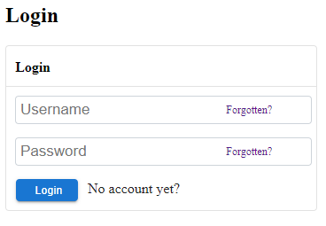

# @scripty/react-modules

# Description

lightweight react login component.



# Usage
```bash
npm install -s @scripty/react-modules
```

##### Client: Example.jsx

```javascript
import React from 'react';
import { BrowserRouter as Router } from 'react-router-dom';
import { Login } from '@scripty/react-modules';

export const Example = () => {

    const onLoginSubmit = (data) => {
        const { username, password } = data;
        console.log(username, password);
    }

    const onRegisterSubmit = (data) => {
        const { username, password } = data;
        console.log(username, password);
    }

    const onForgotUsernameSubmit = (username) => {
        console.log(username);
    }

    const onForgotPasswordSubmit = (password) => {
        console.log(password);
    }

    return (
        <Router>
            <h2>Login</h2>
            <Login
                width={350}
                onLoginSubmit={onLoginSubmit}
                onRegisterSubmit={onRegisterSubmit}
                onForgotUsernameSubmit={onForgotUsernameSubmit}
                onForgotPasswordSubmit={onForgotPasswordSubmit}
                loginPath={'/login'}
                registerPath={'/register'}
            />
        </Router>
    );
};

```
# Components

Name              | Features                                                      |
----------------- |-------------------------------------------------------------- |
Login             | Reset password, forgot password, forgot username              |
Registration      |                                                               |

# Login Properties

Property                           | Type        |  Default / Description  |
-----------------------------------|------------ |-----------
title (optional)                   | String      | Login
width (optional)                   | number      | 100%
onLoginSubmit (required)           | Function    |
onRegisterSubmit (optional)        | Function    |
onForgotUsernameSubmit (optional)  | Function    |
onForgotPasswordSubmit (optional)  | Function    |
onPasswordReset (optional)         | Function    | url params :userId and :token needed. returns token, userId and new password
loginPath (optional)               | String      | /login
registerPath (optional)            | String      | /register

# Registration Properties

Property                     | Type           |  Default  |
---------------------------- |--------------- |-----------
registerPath (optional)      | String         | /register
title (optional)             | String         | Register
onRegisterSubmit (required)  | Function       |
children (optional)          | React Children |
